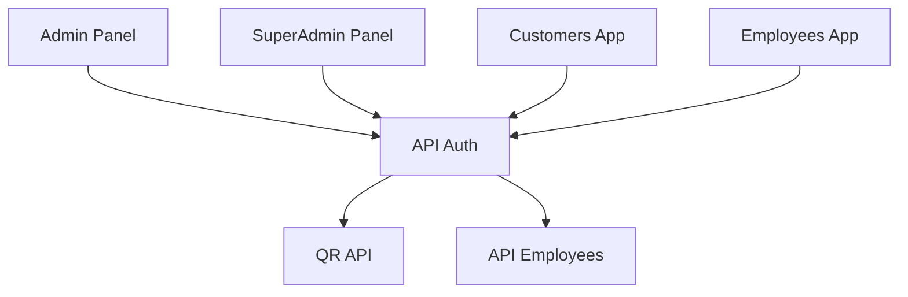

# Components Overview

This section provides detailed information about each component in the QRcoats system.

## Frontend Components

### Admin Panel

The Admin Panel is designed for administrative users. Key components include:
- User management
- QR code management
- Reporting dashboards
- System settings

[Learn more about Admin Panel](../../admin/index.md)

### SuperAdmin Panel

The SuperAdmin Panel provides extended capabilities for system administrators. Key components include:
- Organization management
- System-wide configuration
- Audit and monitoring tools

[Learn more about SuperAdmin Panel](../../superadmin/index.md)

### Customers Application

The Customers Application is designed for end-users. Key components include:
- Account management
- QR code generation and management
- Usage statistics and reports

[Learn more about Customers Application](../../customers/index.md)

### Employees Application

The Employees Application is designed for staff members. Key components include:
- Task management
- QR code scanning and processing
- Customer interaction tools

[Learn more about Employees Application](../../employees/index.md)

## Backend Components

### API Auth Service

The API Auth Service handles authentication and authorization. Key components include:
- Authentication controllers
- User management
- Role-based access control

[Learn more about API Auth Service](../../api-auth/index.md)

### API Employees Service

The API Employees Service manages employee data and operations. Key components include:
- Employee data controllers
- Task management
- Performance metrics

[Learn more about API Employees Service](../../api-employees/index.md)

### QR API Service

The QR API Service handles QR code functionality. Key components include:
- QR code generation
- QR code verification
- QR code analytics

[Learn more about QR API Service](../../qr-api/index.md)

## Component Dependencies

This diagram shows dependencies between components:

