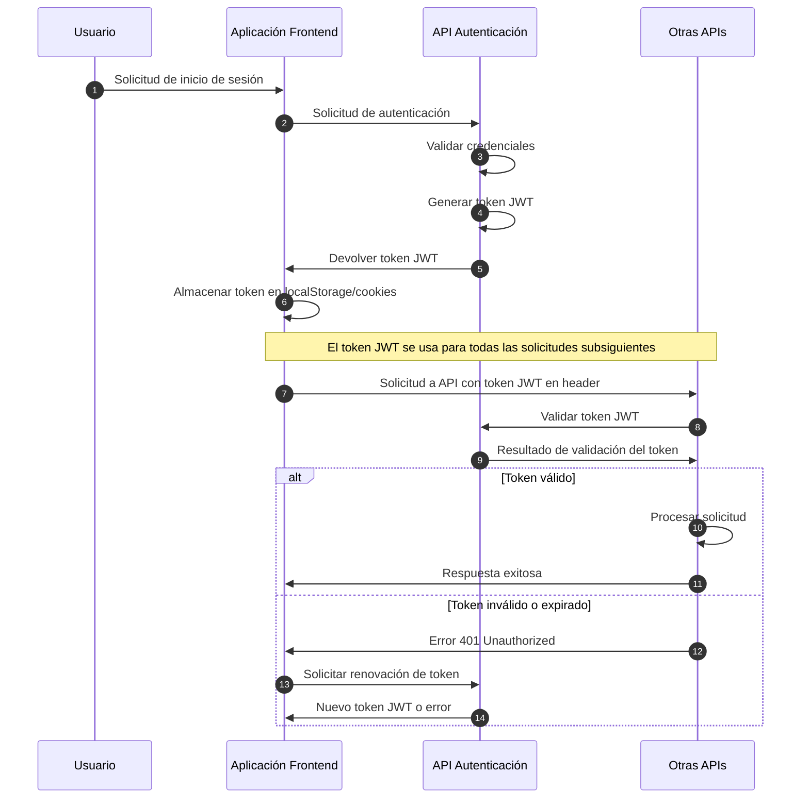
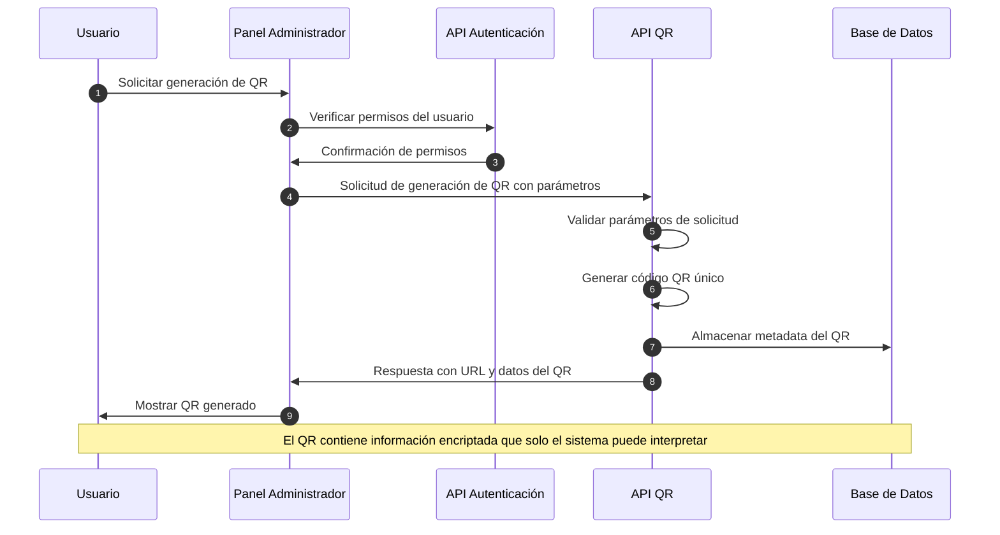
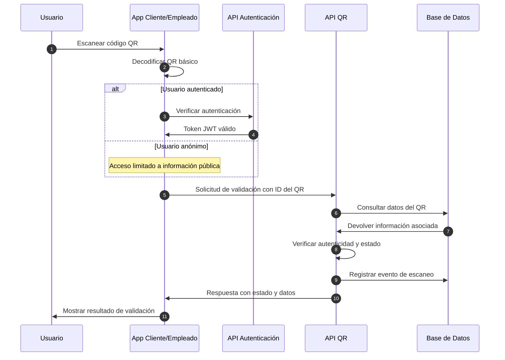
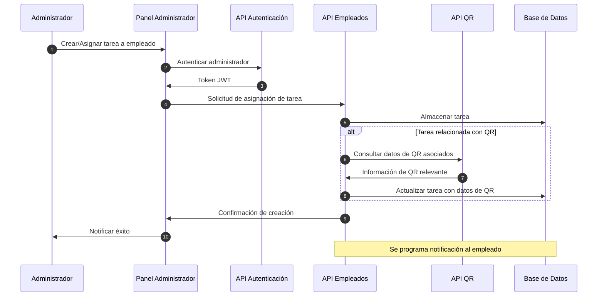
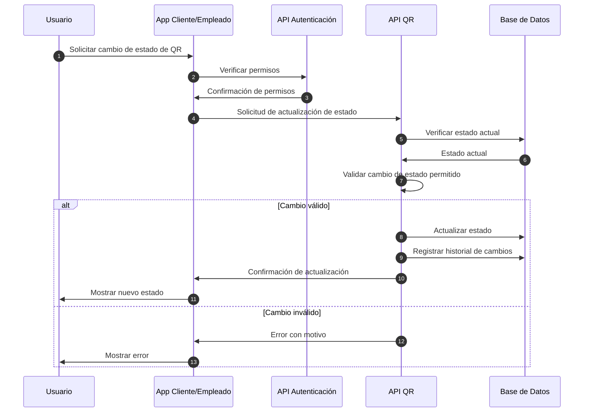
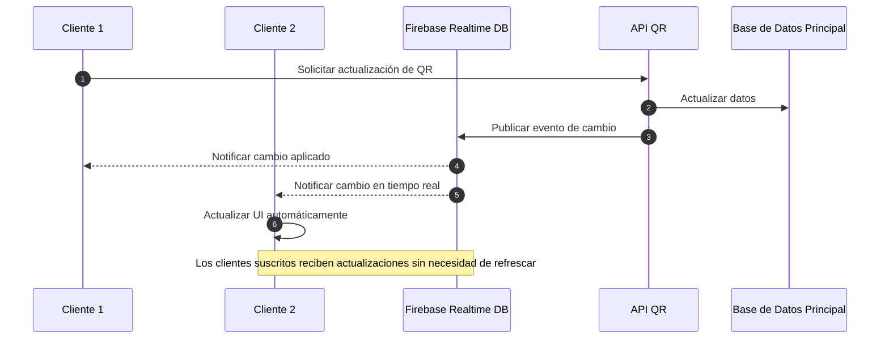

# Flujo de Datos

Esta sección explica cómo fluyen los datos entre los diferentes componentes del sistema QRcoats.

## Flujo de Autenticación

El proceso de autenticación es crucial para asegurar que solo los usuarios autorizados accedan a los diferentes servicios del sistema.

## Flujo de Generación de Códigos QR

La generación de códigos QR es una función central del sistema QRcoats, que permite a los usuarios crear identificadores únicos para sus productos.

## Flujo de Validación de Códigos QR

La validación de los códigos QR permite a los empleados y usuarios verificar la autenticidad de los productos.

## Flujo de Gestión de Empleados

La gestión de empleados permite asignar tareas y hacer seguimiento de su desempeño.

## Flujo de Actualización de Estado de QR

Los códigos QR pueden cambiar de estado durante su ciclo de vida (asignado, activado, expirado, etc.).

## Flujo de Sincronización en Tiempo Real

QRcoats utiliza Firebase para mantener sincronizados los datos en tiempo real entre diferentes clientes.

## Almacenamiento de Datos

QRcoats utiliza diferentes bases de datos dependiendo del servicio y los requisitos de rendimiento:

### Base de Datos Principal (PostgreSQL)

- **API de Autenticación**: 
  - Cuentas de usuario
  - Roles y permisos
  - Registro de inicios de sesión
  - Tokens de refresco
  
- **API de Empleados**:
  - Datos de empleados
  - Asignaciones de tareas
  - Métricas de rendimiento
  - Informes generados

- **API de QR**:
  - Datos básicos de QRs
  - Relaciones entre QRs y productos
  - Configuraciones de seguridad
  - Estadísticas de uso

### Base de Datos en Tiempo Real (Firebase)

- Actualizaciones en tiempo real de estado de QRs
- Notificaciones a empleados
- Estados de escaneo activos
- Registros temporales de acciones

### Almacenamiento de Objetos (AWS S3)

- Imágenes de QRs generados
- Recursos visuales asociados a productos
- Backups de códigos generados
- Archivos de informes

## Consideraciones de Seguridad

La arquitectura de QRcoats implementa múltiples capas de seguridad para proteger los datos:

- **Seguridad en Tránsito**:
  - Todas las comunicaciones utilizan HTTPS/TLS 1.3
  - Los WebSockets para actualizaciones en tiempo real implementan encriptación
  - Las claves API están protegidas y se rotan periódicamente

- **Seguridad de Autenticación**:
  - Los tokens JWT utilizan algoritmos seguros (RS256)
  - Tiempo de expiración corto (15-60 minutos)
  - Implementación de tokens de refresco con invalidación en cascada
  - Protección contra ataques de fuerza bruta

- **Seguridad de Datos**:
  - Encriptación de datos sensibles en reposo
  - Los QRs contienen firmas digitales para prevenir falsificaciones
  - Implementación de control de acceso basado en roles (RBAC)
  - Registro detallado de auditoría para todas las operaciones sensibles

- **Protección contra Vulnerabilidades**:
  - Validación estricta de datos de entrada
  - Protección contra inyección SQL y NoSQL
  - Cabeceras de seguridad configuradas (CORS, CSP, X-XSS-Protection)
  - Escaneo regular de vulnerabilidades y actualizaciones 