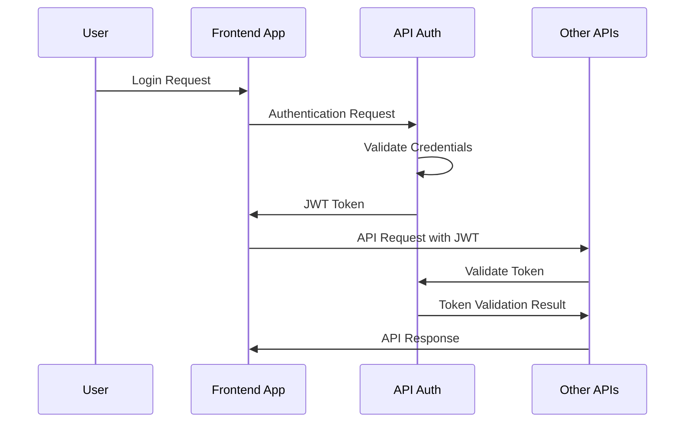
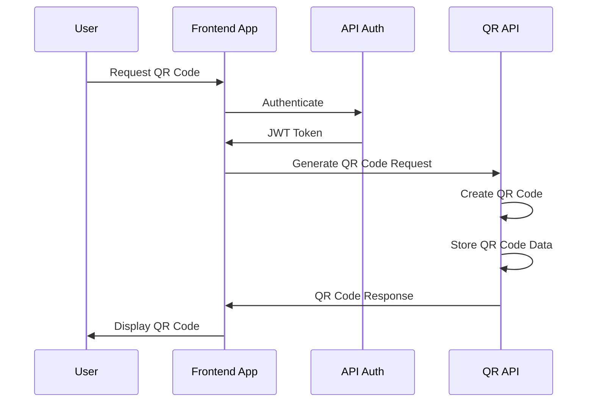
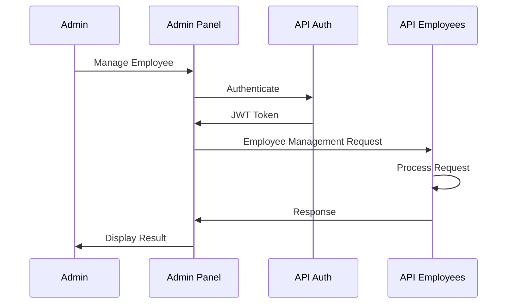

# Data Flow

This section explains how data flows between different components in the QRcoats system.

## Authentication Flow

## QR Code Generation Flow

## Employee Management Flow

## Data Storage

Data is stored in different databases depending on the service:

- **Auth Service**: User accounts, permissions, and tokens
- **Employees Service**: Employee data, tasks, and performance metrics
- **QR API Service**: QR code data, scan history, and analytics

## Data Synchronization

[Details about how data is synchronized between services]

## Security Considerations

- All data in transit is encrypted using HTTPS
- Sensitive data is encrypted at rest
- JWT tokens have short expiration times
- Role-based access control limits data access 