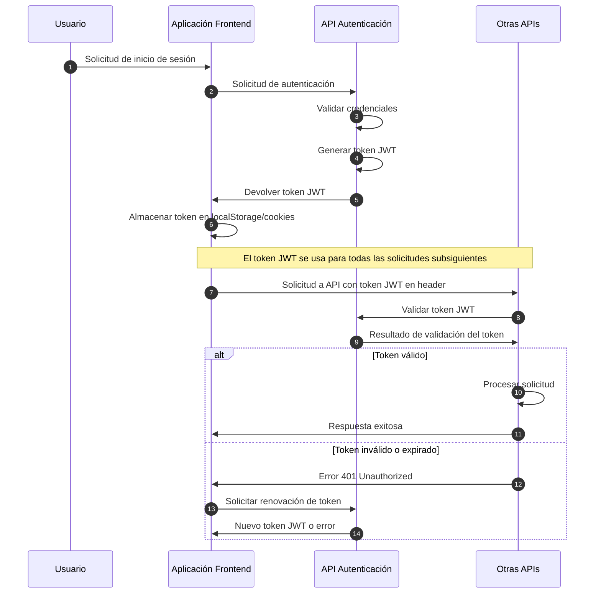
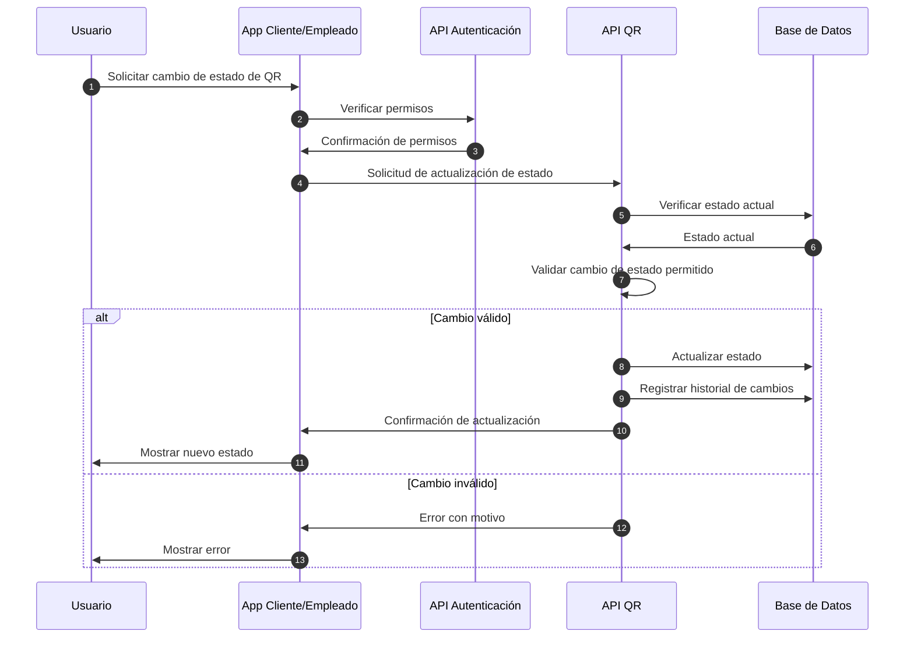
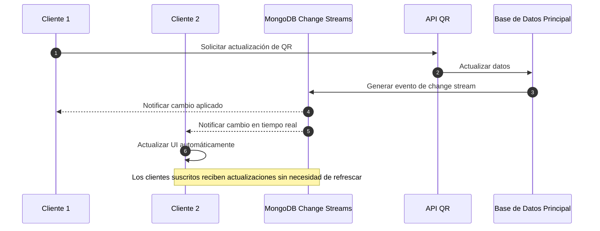

# Flujo de Datos

Esta sección explica cómo fluyen los datos entre los diferentes componentes del sistema QRcoats.

## Flujo de Autenticación

El proceso de autenticación es crucial para asegurar que solo los usuarios autorizados accedan a los diferentes servicios del sistema.



## Flujo de Generación de Códigos QR

La generación de códigos QR es una función central del sistema QRcoats, que permite a los usuarios crear identificadores únicos para sus productos.

```mermaid
sequenceDiagram
    autonumber
    participant Usuario
    participant Admin as Panel Administrador
    participant Auth as API Autenticación
    participant QR as API QR
    participant DB as Base de Datos
    
    Usuario->>Admin: Solicitar generación de QR
    Admin->>Auth: Verificar permisos del usuario
    Auth->>Admin: Confirmación de permisos
    
    Admin->>QR: Solicitud de generación de QR con parámetros
    
    QR->>QR: Validar parámetros de solicitud
    QR->>QR: Generar código QR único
    QR->>DB: Almacenar metadata del QR
    
    QR->>Admin: Respuesta con URL y datos del QR
    Admin->>Usuario: Mostrar QR generado
  ```

## Flujo de Validación de Códigos QR

La validación de los códigos QR permite a los empleados y usuarios verificar la autenticidad de los productos.

```mermaid
sequenceDiagram
    autonumber
    participant Usuario
    participant AppCliente as App Cliente/Empleado
    participant Auth as API Autenticación
    participant QR as API QR
    participant DB as Base de Datos
    
    Usuario->>AppCliente: Escanear código QR
    AppCliente->>AppCliente: Decodificar QR básico
    
    alt Usuario autenticado
        AppCliente->>Auth: Verificar autenticación
        Auth->>AppCliente: Token JWT válido
    else Usuario anónimo
        Note over AppCliente: Acceso limitado a información pública
    end
    
    AppCliente->>QR: Solicitud de validación con ID del QR
    QR->>DB: Consultar datos del QR
    DB->>QR: Devolver información asociada
    
    QR->>QR: Verificar autenticidad y estado
    QR->>DB: Registrar evento de escaneo
    
    QR->>AppCliente: Respuesta con estado y datos
    AppCliente->>Usuario: Mostrar resultado de validación
```

## Flujo de Actualización de Estado de QR

Los códigos QR pueden cambiar de estado durante su ciclo de vida (asignado, activado, expirado, etc.).



## Flujo de Sincronización en Tiempo Real

QRcoats utiliza MongoDB para mantener sincronizados los datos en tiempo real entre diferentes clientes.



## Almacenamiento de Datos

QRcoats utiliza MongoDB como su sistema de base de datos principal para todos sus componentes. Esta elección permite una gestión flexible de los datos con un esquema adaptable a las necesidades cambiantes del negocio.

### Base de Datos MongoDB

El sistema utiliza Mongoose como ODM (Object Document Mapper) para interactuar con MongoDB. Ambas APIs (`api_employees` y `qr-api`) se conectan a MongoDB a través de la configuración establecida en sus archivos `.env` y utilizan el módulo `MongooseModule` de NestJS para definir y gestionar sus modelos.

#### Colecciones Principales del Sistema

##### Usuarios y Autenticación

- **Users**: Almacena información de todos los usuarios del sistema con esquemas que incluyen:

  ```typescript
  @Prop() name: string;
  @Prop() username: string;
  @Prop() email: string;
  @Prop() password: string;
  @Prop() rol: string;
  @Prop() status: boolean;
  ```

- **Authentication**: Gestiona los tokens JWT y registros de inicios de sesión

##### Gestión de Negocios

- **Clubs**: Información de los clubes registrados en el sistema

  ```typescript
  @Prop() name: string;
  @Prop() icon: string; 
  @Prop() customNote: string;
  @Prop() openingHour: string;
  @Prop() closingHour: string;
  @Prop() services: Array<Service>;
  @Prop({ type: mongoose.Schema.Types.ObjectId, ref: 'Plan' }) plan: mongoose.Schema.Types.ObjectId;
  ```

- **Plans**: Define los planes disponibles para los clubes

  ```typescript
  @Prop() planName: string;
  @Prop() description: string;
  @Prop() numberCustomFields: number;
  @Prop() numberLocations: number;
  ```

##### Gestión de Recursos

- **Locations**: Ubicaciones físicas dentro de los clubes
- **Racks**: Estanterías para guardar objetos
- **Slots**: Espacios específicos dentro de las ubicaciones
- **Hangers**: Colgadores utilizados para prendas

##### Códigos QR y Órdenes

- **QRs**: Datos de todos los códigos QR generados

  ```typescript
  @Prop() email: string;
  @Prop() name: string;
  @Prop() paymentStatus: boolean;
  @Prop() services: service;
  @Prop() qrstatus: string;
  @Prop() clubId: mongoose.Schema.Types.ObjectId;
  @Prop() active: boolean;
  @Prop() used: boolean;
  @Prop() urlQr: string;
  ```

- **Orders**: Pedidos realizados en el sistema
- **Payments**: Información de pagos procesados

##### Elementos Específicos de qr-api

- **Pass**: Datos para gestión de pases digitales
- **DiscountCode**: Códigos de descuento disponibles
- **Daily**: Registros diarios de actividad
- **Registros**: Historial de registros generales

### Relaciones entre Entidades

El sistema utiliza IDs de MongoDB (`ObjectId`) para establecer relaciones entre las diferentes entidades:

```typescript
// Ejemplo de relación entre Club y Plan
@Prop({ type: mongoose.Schema.Types.ObjectId, ref: 'Plan' })
plan: mongoose.Schema.Types.ObjectId;

// Ejemplo de relación uno a muchos (Usuario a Empleados)
@Prop({ type: [{ type: mongoose.Schema.Types.ObjectId, ref: 'User' }] })
employees: mongoose.Schema.Types.ObjectId[];
```

### Cambios en Tiempo Real

MongoDB proporciona capacidades de cambios en tiempo real a través de Change Streams, permitiendo que la aplicación reaccione instantáneamente a modificaciones en la base de datos. Esto es particularmente útil para:

- Actualización de estados de QR
- Notificaciones en tiempo real
- Sincronización entre diferentes clientes

### Consideraciones de Seguridad y Rendimiento

- Las contraseñas se almacenan encriptadas usando bcrypt
- Los índices en MongoDB están configurados para optimizar las consultas frecuentes
- Se utilizan referencias entre documentos para mantener la consistencia de los datos
- La autenticación se realiza mediante tokens JWT con tiempos de expiración configurables

## Consideraciones de Seguridad

La arquitectura de QRcoats implementa múltiples capas de seguridad para proteger los datos:

- **Seguridad en Tránsito**:
  - Todas las comunicaciones utilizan HTTPS/TLS 1.3
  - Los WebSockets para actualizaciones en tiempo real implementan encriptación
  - Las claves API están protegidas y se rotan periódicamente

- **Seguridad de Autenticación**:
  - Los tokens JWT utilizan algoritmos seguros (RS256)
  - Tiempo de expiración corto (15-60 minutos)
  - Implementación de tokens de refresco con invalidación en cascada
  - Protección contra ataques de fuerza bruta

- **Seguridad de Datos**:
  - Encriptación de datos sensibles en reposo
  - Los QRs contienen firmas digitales para prevenir falsificaciones
  - Implementación de control de acceso basado en roles (RBAC)
  - Registro detallado de auditoría para todas las operaciones sensibles

- **Protección contra Vulnerabilidades**:
  - Validación estricta de datos de entrada
  - Protección contra inyección SQL y NoSQL
  - Cabeceras de seguridad configuradas (CORS, CSP, X-XSS-Protection)
  - Escaneo regular de vulnerabilidades y actualizaciones
