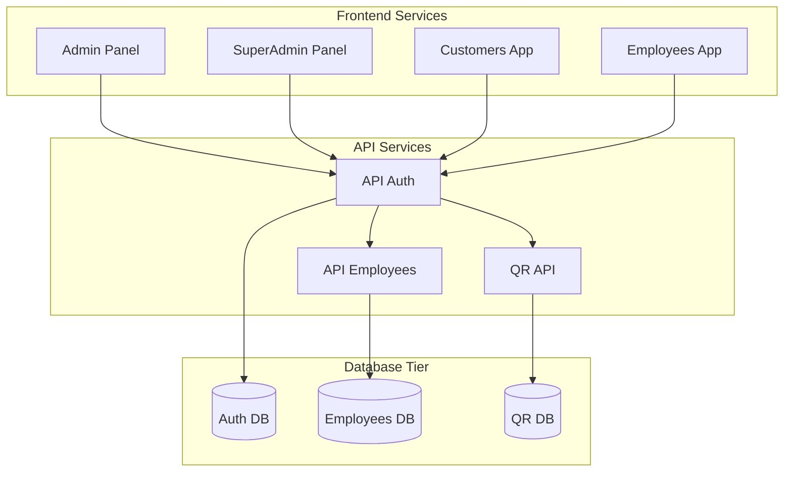

# Deployment Architecture

This section provides information about how the QRcoats system is deployed and the infrastructure that supports it.

## Deployment Overview

The QRcoats system follows a microservices architecture with separate deployment for each service:



## Infrastructure

[Details about infrastructure, cloud providers, etc.]

## Container Orchestration

The services are containerized using Docker and orchestrated with Kubernetes:

```
QRcoats/
├── Admin/               # Admin Panel frontend
│   └── Dockerfile
├── SuperAdmin/          # SuperAdmin Panel frontend
│   └── Dockerfile
├── Customers/           # Customers App frontend
│   └── Dockerfile
├── Employees/           # Employees App frontend
│   └── Dockerfile
├── api-auth/            # Authentication service
│   └── Dockerfile
├── api-employees/       # Employee management service
│   └── Dockerfile
├── qr-api/              # QR code service
│   └── Dockerfile
└── kubernetes/          # Kubernetes configuration
    ├── frontend/
    └── backend/
```

## Scaling

[Details about scaling strategies]

## Monitoring and Logging

[Details about monitoring and logging solutions]

## CI/CD Pipeline

[Details about CI/CD pipeline]

## Environment Setup

### Development Environment

[Details about development environment setup]

### Staging Environment

[Details about staging environment]

### Production Environment

[Details about production environment] 