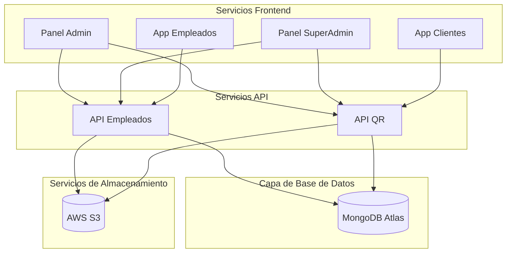

# Arquitectura de Despliegue

Esta sección proporciona información detallada sobre cómo se despliega el sistema QRcoats y la infraestructura que lo soporta.

## Visión General del Despliegue

El sistema QRcoats sigue una arquitectura de microservicios con despliegue separado para cada servicio:



## Infraestructura

El sistema QRcoats utiliza las siguientes tecnologías para su infraestructura:

- **Servidores de Aplicación**: Servidores Node.js corriendo en contenedores Docker
- **Base de Datos**: MongoDB Atlas (servicio gestionado en la nube)
- **Almacenamiento de Objetos**: AWS S3 para guardar imágenes y archivos
- **Autenticación**: Sistema propio basado en JWT
- **Envío de Emails**: Mailgun para el envío de correos electrónicos
<!-- - **Notificaciones Push**: Firebase para notificaciones push -->

## Contenedores Docker

Ambas APIs están contenedorizadas con Docker para garantizar entornos consistentes de desarrollo y producción:

### qr-api (API para clientes)

- **Base**: Node.js 18.15.0
- **Puerto Expuesto**: 3000
- **Configuración de Docker Compose**:
  - Microservicio principal
  - Opción para MongoDB local para desarrollo

```yaml
# docker-compose.yml
version: '3'
services:
  api:
    build: ./
    container_name: qr-api
    ports:
      - "3000:3000"
    env_file:
      - .env
```

### api_employees (API para empleados)

- **Base**: Node.js 20 Alpine
- **Puerto Expuesto**: 3001
- **Configuración de Docker Compose**:
  - Soporte para MongoDB local (desarrollo)

```yaml
# docker-compose.yml
version: '3.8'
services:
  mongodb:
    image: mongo:latest
    container_name: qr-coats-db
    ports:
      - '27017:27017'
    volumes:
      - ./db:/data/db
```

## Estructura de Directorios del Proyecto

La estructura general del proyecto sigue este patrón:

```
QRcoats/
├── Admin/               # Panel Administrador (frontend)
│   └── Dockerfile
├── SuperAdmin/          # Panel SuperAdmin (frontend)
│   └── Dockerfile
├── Customers/           # Aplicación de clientes (frontend)
│   └── Dockerfile
├── Employees/           # Aplicación de empleados (frontend)
│   └── Dockerfile
├── api_employees/       # API para gestión de empleados
│   ├── Dockerfile
│   ├── docker-compose.yml
│   └── src/
│       ├── endpoints/   # Endpoints API REST
│       ├── core/        # Entidades y lógica de negocio 
│       └── repos/       # Acceso a datos
├── qr-api/              # API para clientes y códigos QR
│   ├── Dockerfile
│   ├── docker-compose.yml
│   └── src/
│       ├── endpoints/   # Endpoints API REST
│       └── commons/     # Código compartido y utilitarios
```

## Conexión a Base de Datos

Ambas APIs se conectan a la misma instancia de MongoDB Atlas en producción, pero pueden usar instancias locales en desarrollo:

```typescript
// Ejemplo de conexión en app.module.ts
@Module({
  imports: [
    MongooseModule.forRoot(process.env.URI_MONGODB),
    // otros módulos...
  ],
})
```

## Escalabilidad

La arquitectura está diseñada para escalar horizontalmente:

- **APIs**: Escalables mediante la adición de más instancias detrás de un balanceador de carga
- **Base de Datos**: MongoDB Atlas proporciona escalabilidad automática
- **Almacenamiento**: AWS S3 ofrece escalabilidad ilimitada para almacenamiento de objetos

## Monitoreo y Logging

Para monitoreo y logging, el sistema implementa:

- **Logs de la Aplicación**: Registros en archivos locales y envío a sistemas de logging
  - `file_log.txt` en qr-api para logs de operaciones
- **Monitoreo de Bases de Datos**: MongoDB Atlas proporciona herramientas de monitoreo
- **Alertas**: Configuración de alertas para errores críticos

## Entornos

### Entorno de Desarrollo

- Cada desarrollador puede ejecutar la aplicación localmente con Docker Compose
- Base de datos MongoDB local o conexión a una instancia de desarrollo compartida
- Variables de entorno configuradas para desarrollo

### Entorno de Producción

- Despliegue en servidores dedicados o servicios en la nube
- Conexión a MongoDB Atlas para producción
- Variables de entorno seguras y cifradas
- Gestión de certificados SSL para HTTPS
