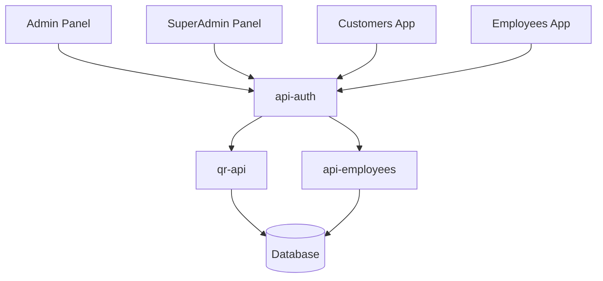

# System Architecture

This section provides a comprehensive overview of the QRcoats system architecture, showing how all components interact with each other.

## Overview

QRcoats follows a microservices architecture with separate frontend applications and backend API services:

- Frontend applications (Admin, SuperAdmin, Customers, Employees)
- Backend services (api-auth, api-employees, qr-api)

## System Diagram

## Key Architecture Documents

- [Components Overview](./components/index.md) - Detailed information about each component
- [Data Flow](./data-flow/index.md) - How data flows between components
- [Deployment Architecture](./deployment/index.md) - Information about deployment and infrastructure

## Component Interactions

- **Frontend applications** consume the backend APIs
- **api-auth** handles authentication and authorization for all applications
- **api-employees** manages employee-specific functionality
- **qr-api** handles QR code generation and management

## Technology Stack

- Frontend: React/TypeScript
- Backend: NestJS
- Database: [Database Technology]
- Authentication: JWT/OAuth
- Deployment: [Deployment Technology] 