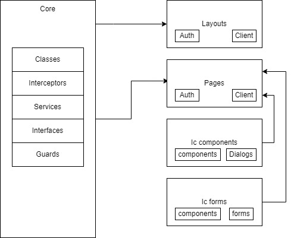

# Aplicación para Empleados

La aplicación para Empleados (Employees) es una aplicación web desarrollada con Angular diseñada para que los trabajadores del club puedan gestionar los QR coats asignados a los clientes.

## Visión General

La aplicación para Empleados permite a los trabajadores del club:
- Gestionar su autenticación y perfil
- Seleccionar club y ubicación de trabajo
- Generar códigos QR para clientes
- Escanear y validar QR codes
- Administrar items (prendas) y su ubicación en los racks
- Ver y gestionar el estado de los QR activos

## Primeros Pasos para Desarrolladores

### Requisitos Previos

- Node.js (v16 o superior)
- npm
- Angular CLI (v16)
- Git

### Instalación y Configuración

```bash
# Clonar el repositorio
git clone <url-del-repositorio>

# Navegar al directorio Employees
cd Employees

# Instalar dependencias
npm install

# Iniciar servidor de desarrollo
ng serve
```

### Scripts Disponibles

- `ng serve` - Inicia el servidor de desarrollo
- `ng build` - Genera la versión de producción
- `ng test` - Ejecuta los tests unitarios con Jest
- `ng test:watch` - Ejecuta los tests en modo watch
- `ng test:coverage` - Ejecuta los tests y genera informe de cobertura

### Entornos de Desarrollo

La aplicación utiliza diferentes configuraciones para distintos entornos, que se pueden encontrar en la carpeta `environments/`.

## Arquitectura del Proyecto

La aplicación sigue una arquitectura modular organizada en la siguiente estructura:

```
Employees/
├── src/                 # Código fuente
│   ├── app/             # Código de la aplicación
│   │   ├── core/        # Elementos no visuales (reglas de negocio)
│   │   │   ├── classes/     # Lógica reutilizable
│   │   │   ├── services/    # Servicios específicos
│   │   │   ├── interceptors/# Interceptores HTTP
│   │   │   ├── guards/      # Guards de ruta
│   │   │   └── interfaces/  # Interfaces de datos
│   │   ├── layouts/     # Componentes de layout
│   │   ├── pages/       # Páginas enrutables
│   │   │   ├── auth/        # Páginas de autenticación
│   │   │   └── client/      # Páginas principales
│   │   │       ├── generateqr/   # Generación de QRs
│   │   │       ├── items/        # Gestión de items
│   │   │       ├── camera/       # Escaneo de QRs
│   │   │       ├── club/         # Gestión de club
│   │   │       └── club-selection/ # Selección de club
│   │   ├── shared-components/ # Componentes compartidos
│   │   └── ic-forms/   # Formularios reutilizables
│   ├── assets/         # Recursos estáticos
│   └── environments/   # Configuraciones por entorno
├── package.json       # Dependencias y scripts
└── angular.json       # Configuración de Angular
```



## Tecnologías Principales

La aplicación para Empleados está construida con:

- **Angular 16**: Framework principal
- **TypeScript**: Lenguaje de programación
- **Angular Material**: Biblioteca de componentes UI
- **RxJS**: Para programación reactiva
<!-- - **Firebase**: Para funcionalidades de backend -->
- **Jest**: Para testing unitario
- **QR-Scanner**: Para escaneo de códigos QR
- **QRCode**: Para generación de códigos QR

## Características Principales

### Autenticación
- Sistema de login para empleados
- Gestión de sesiones
- Guards para rutas protegidas

### Selección de Club y Ubicación
- Interfaz para seleccionar el club de trabajo
- Gestión de ubicaciones dentro del club

### Generación de QR
- Generación de códigos QR para clientes
- Asignación de QR a ubicaciones específicas

### Gestión de Items
- Vista principal para gestionar prendas
- Funcionalidad de búsqueda y filtrado
- Paginación infinita
- Organización por racks y slots

### Escaneo de QR
- Funcionalidad de cámara para escanear QR
- Validación en tiempo real
- Procesamiento de información del QR

## Servicios Principales

Los servicios están organizados en el directorio `core/services/` y proporcionan funcionalidad específica:

- **auth**: Servicios de autenticación
- **club**: Gestión de clubes
- **qr**: Operaciones con QR
- **items**: Gestión de items/prendas
- **racks**: Administración de racks y slots
- **locations**: Gestión de ubicaciones
<!-- - **firebase**: Integración con Firebase -->

## Componente de Items - Clave para la Aplicación

El componente `ItemsComponent` es fundamental en la aplicación y gestiona la visualización y manipulación de QRs:

### Características Principales
- **Paginación Infinita**: Carga progresiva de QRs al hacer scroll
- **Filtrado y Búsqueda**: Búsqueda por nombre, correo o estado
- **Ordenamiento**: Organización ascendente/descendente
- **Acciones Específicas**: swap, detach, visualize, push

### Flujo de Datos
1. **Inicialización**: Carga inicial de QRs activos con skeleton loader
2. **Separación**: División entre QRs asignados y sin asignar
3. **Actualización en Tiempo Real**: Observable para cambios en la lista
4. **Scroll Infinito**: Detección de final de lista para cargar más datos

## Flujo de Trabajo Recomendado

Para desarrollar o mantener esta aplicación:

1. **Familiarización con la Arquitectura**: Comprender la división en módulos
2. **Entender el Flujo de Autenticación**: Revisar los guards y servicios
3. **Estudiar el Flujo de QR**: Explorar la generación, escaneo y gestión
4. **Revisar los Servicios Core**: Analizar la lógica de negocio
5. **Explorar los Componentes Principales**: Especialmente ItemsComponent

## Buenas Prácticas

1. **Testing Unitario**: La app utiliza Jest para pruebas unitarias
2. **Modelo de Datos Tipado**: Usar interfaces para todos los datos
3. **Separación de Responsabilidades**: Seguir el patrón de servicios y componentes
4. **Manejo de Estado Reactivo**: Utilizar RxJS para flujos de datos
5. **Documentación de Código**: Mantener comentarios explicativos 
6. **Seguir la Arquitectura**: Respetar la organización de carpetas existente

## Consejos para Nuevos Desarrolladores

1. **Explorar el Código Gradualmente**: Comenzar por los módulos de autenticación y QR
2. **Utilizar ng serve**: Ver los cambios en tiempo real
3. **Revisar la Implementación de Servicios**: Entender cómo se comunican con el backend
4. **Explorar los Formularios**: Entender la validación y estructura
5. **Revisar los Guards**: Comprender la protección de rutas
6. **Ejecutar Tests**: Familiarizarse con la suite de pruebas 